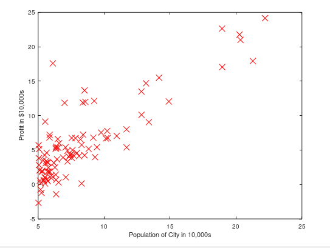

# Programming Exercise 1: Linear Regression

### WarmUpExercise
    function A = warmUpExercise()
    
        A = [];
        A = eye(5);
     
     end

Return a 5 x 5 identity matrix.

1   &nbsp;&nbsp;&nbsp;0   &nbsp;&nbsp;&nbsp;0   &nbsp;&nbsp;&nbsp;0   &nbsp;&nbsp;&nbsp;0  
0   &nbsp;&nbsp;&nbsp;1   &nbsp;&nbsp;&nbsp;0   &nbsp;&nbsp;&nbsp;0   &nbsp;&nbsp;&nbsp;0  
0   &nbsp;&nbsp;&nbsp;0   &nbsp;&nbsp;&nbsp;1   &nbsp;&nbsp;&nbsp;0   &nbsp;&nbsp;&nbsp;0  
0   &nbsp;&nbsp;&nbsp;0   &nbsp;&nbsp;&nbsp;0   &nbsp;&nbsp;&nbsp;1   &nbsp;&nbsp;&nbsp;0  
0   &nbsp;&nbsp;&nbsp;0   &nbsp;&nbsp;&nbsp;0   &nbsp;&nbsp;&nbsp;0   &nbsp;&nbsp;&nbsp;1  

### Load the Data

    data = load('ex1data1.txt');
    X = data(:, 1); 
    y = data(:, 2);
    m = length(y); % number of training examples
    
### Plotting the Data

    function plotData(x, y) 
    
        figure; % open a new figure window
        plot(x, y, 'rx', 'MarkerSize', 10); % Plot the data
        ylabel('Profit in $10,000s'); % Set the y?axis label
        xlabel('Population of City in 10,000s'); % Set the x?axis label
        
    end
    

### Compute Cost function
    function J = computeCost(X, y, theta)
    
        m = length(y); % number of training examples
        J = 1/(2*m)*sum((X*theta-y).^2); 
        
    end

### Gradient Descent

    function [theta, J_history] = gradientDescent(X, y, theta, alpha, num_iters)

        m = length(y); % number of training examples
        J_history = zeros(num_iters, 1);

        for iter = 1:num_iters
        
            theta=theta-(alpha/m)*((X*theta-y)'*X)';

            % Save the cost J in every iteration    
            J_history(iter) = computeCost(X, y, theta);

        end

    end
    
### Gradient Descent - Non-vectorized 

    function [theta, J_history] = gradientDescent2(X, y, theta, alpha, num_iters)

    % Initialize some useful values

    m = length(y); % number of training examples
    J_history = zeros(num_iters, 1);

    theta1 = theta(1);
    theta2 = theta(2);

    temp0 = 0;
    temp1 = 0;
    error = 0;

    for iter = 1:(num_iters)
    
        h = X * theta; %heres the variable i moved into the loop

        temp0 = 0;
        temp1 = 0;

        for i=1:m
            error = (h(i) - y(i));
            temp0 = temp0 + (error * X(i, 1));
            temp1 = temp1 + (error * X(i, 2));
            %disp(error);
        end

        theta1 = theta1 - ((alpha/m) * temp0)
        theta2 = theta2 - ((alpha/m) * temp1)
        theta = [theta1;theta2];

        J_history(iter) = computeCost(X, y, theta);

    end
    end
